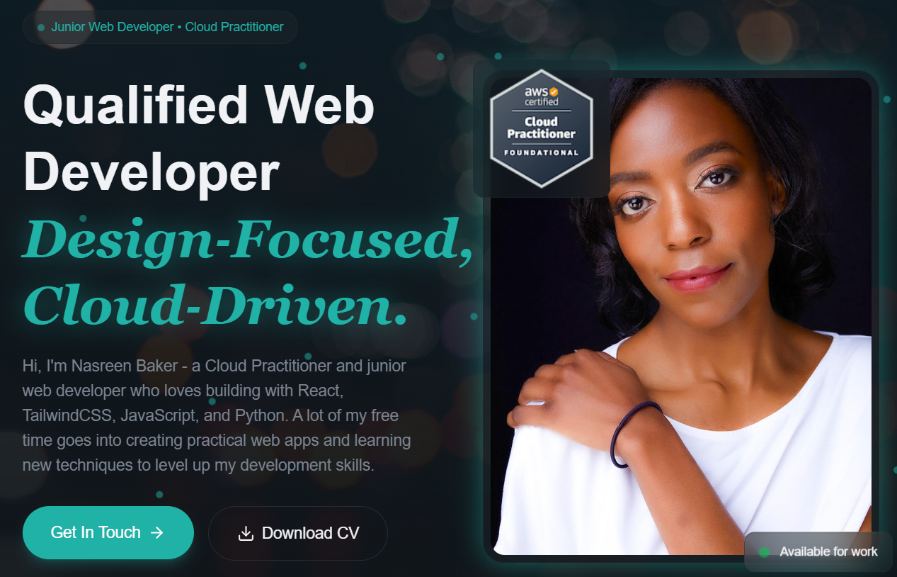
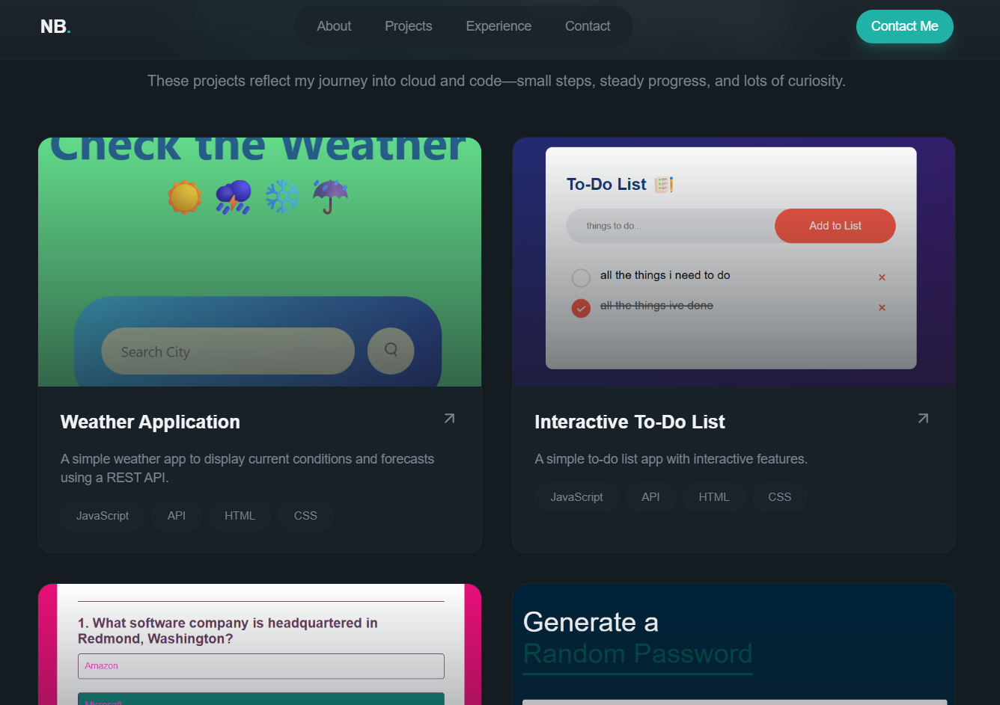
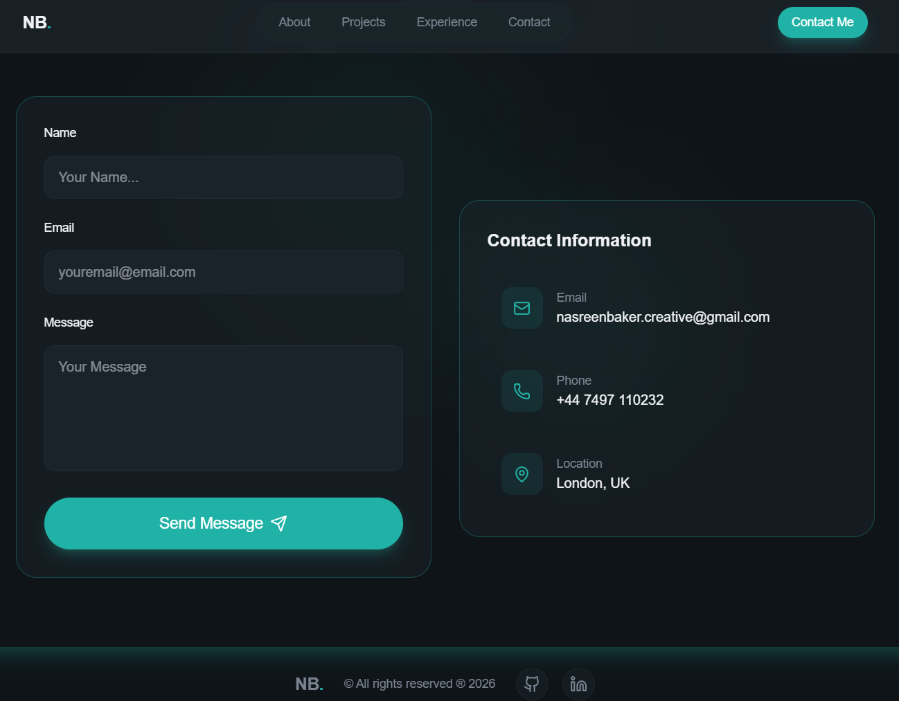

# 🌐 Personal Portfolio — React + Vite + TailwindCSS

This is my personal developer portfolio built using **React**, **Vite**, and **TailwindCSS**.  
It showcases my projects, skills, and experience as an aspiring Cloud & Web Developer.

The site is fully responsive, fast, and deployed via **Vercel**.

Live Demo: https://react-tailwind-css-personal-portfol.vercel.app (react-tailwind-css-personal-portfol.vercel.app in Bing)  
GitHub Repo: https://github.com/STEM-Girlie/React-TailwindCSS-Personal-Portfolio

## Table of Contents

- [Overview](#overview)
- [Features](#features)
- [Tech Stack](#tech-stack)
- [Architecture](#architecture)
- [Installation](#installation)
- [Usage](#usage)
- [Screenshots](#screenshots)
- [Deployment](#deployment)
- [Future Improvements](#future-improvements)
- [Credits](#credits)
- [License](#license)


## Overview

### Motivation
I built this portfolio to present my work professionally as I transition into junior roles in cloud engineering and web development. It serves as a central place for recruiters and hiring managers to explore my projects and technical skills.

### Objective
To create a clean, fast, and responsive portfolio website that highlights my experience, showcases my projects, and provides an easy way for employers to contact me.

 ### Learning Outcomes
- Built a fully responsive UI with TailwindCSS
- Improved component-based development using React
- Practised modern frontend tooling with Vite
- Deployed a production-ready site on Vercel
- Strengthened GitHub workflow and project structure

## Features
- Fully responsive design
- Mobile‑friendly navigation 
- Modern UI built with TailwindCSS
- Smooth navigation and clean layout
- Project showcase section
- About Me section
- Contact section with CTA
- Fast performance with Vite
- Deployed globally via Vercel

## Tech Stack

- **React** — component‑based UI  
- **Vite** — fast development + build tooling  
- **TailwindCSS** — utility‑first styling  
- **JavaScript (ES6+)**  
- **CSS**  
- **HTML**  

## Tools

- Git & GitHub
- VS Code
- Vercel

## Architecture

### Application Flow
User visits site → React renders components → TailwindCSS handles styling → Vercel serves static build globally.

### Folder Structure
```
src/
 ├── components/
 ├── assets/
 ├── styles/
 ├── App.jsx
 └── main.jsx
```
```
public/
index.html
```

## Installation

### Clone the repository:
```
git clone https://github.com/STEM-Girlie/React-TailwindCSS-Personal-Portfolio.git
cd React-TailwindCSS-Personal-Portfolio
```

### Install Dependencies:
```npm install```

### Run Development Server:
```npm run dev```

### Build for Production:
```npm run build```

## Usage
- Open the live demo link
- Navigate through About, Projects, and Contact sections
- Explore showcased projects
- Use the contact section to reach out

## Screenshots





## Deployment
This project is deployed using Vercel.

## Deployment steps:
- Push code to GitHub
- Connect repo to Vercel
- Automatic builds & deployments

## Future Improvements
- Add light mode
- Improve mobile functionality
- Add animations using Framer Motion
- Add a blog or case studies section
- Add backend for contact form (AWS Lambda or Node.js)
- Improve accessibility (ARIA labels, keyboard navigation)


## Credits
Developer: Nasreen Baker  
GitHub: https://github.com/STEM-Girlie  
LinkedIn: [https://www.linkedin.com/in/nasreenbaker]

## License
This project is licensed under the MIT License.
